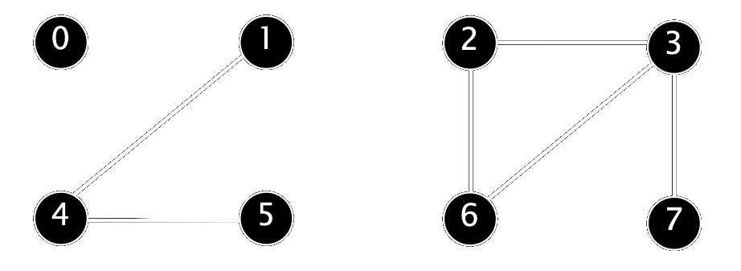
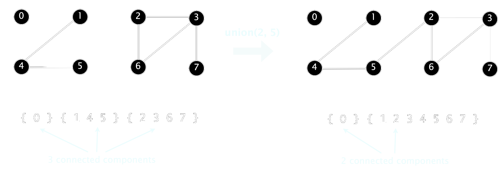

# Dynamic Connectivity

Given a set of N objects.
- **Union command**: connect two objects.
- **Find/connected query**¢: is there a path connecting the two objects?

We assume "is connected to" is an **equivalence relation**:
- Reflexive: _p_ is connected to _p_.
- Symmetric: if _p_ is connected to _q_, then _q_ is connected to _p_.
- Transitive: if _p_ is connected to _q_ and _q_ is connected to _r_,
then _p_ is connected to _r_.

> **Connected components**: Maximal set of objects that are mutually
connected.

{ 0 } { 1 4 5 } { 2 3 6 7 }

 

 

# Quick-find [eager approach] is too slow
Quick-find is too slow

> **Cost model** Number of array accesses (for read or write)

|algorithm|initialize|union|find|
|---------|:--------:|:---:|:--:|
|`quick-find`|N|N|1|

order of growth of number of array accesses

> **Union** is too expensive It takes N² array accesses to process a sequence of N union commands on N objects.